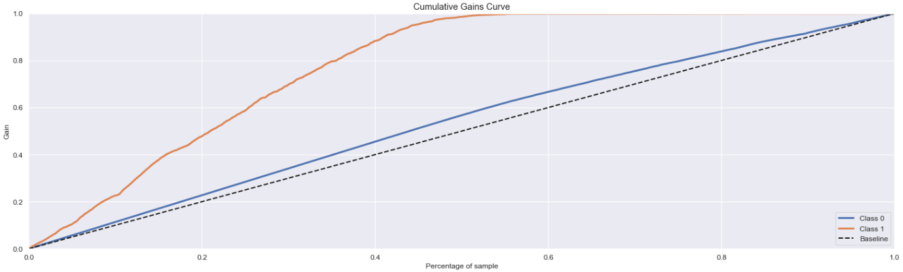

# Health Insurance Cross Sell

# 1. Context

A Health Insurance company is analysing the possibility to offer their clients a new product: a car insurance. As well as the health insurance, the clients of this new product should pay annually to obtain a certain value assured by the company, for their cars. The company surveyed nearly 380,000 clients about the interest in joining a new car insurance product last year. All clients showed interest or not in purcharsing the new insurance product and these responses were saved in a database along with other client attributes. The product teams selected 127,000 new customers who did not respond to the survey to participate in a campaign, in which they will receive an offer of the new car insurance product. The offer will be made by the sales team through phone calls. However, the sales team has the capacity to make 20,000 calls within the campaign period.

# 2. Business Problem

* What is the context like?

    * A Health Insure company is evaluating the possibility to offer their clients a new car insurance product.

* What is the root cause of the problem?

    * The sales team needs to make calls to offer clients the new product, but they can make only 20,000 calls during the campaign.

* Who is the Stakeholder of the problem?

    * The company's CEO.

* How will the solution be?

    * Elaborate a model to predict if a client is interested or not on the new product to prioritize clients with higher chances to purcharse it.

    * Questions to be answered:

        1. Main insights about the most relevant client's attributes interested in purcharsing the car insurance.
        2. What percentage of clients interested in purcharsing car insurance will the sales team be able to contact by making 20,000 calls?
        3. And if the sales teams capacity increases to 40,000 calls, what percentage of customers interested in purcharsing car insurance will the sales team be able to contact?
        4. How many calls does the sales team need to make to contact 80% of customers interested in purcharsing car insurance?

# 3. Data available

Data is available in: https://www.kaggle.com/anmolkumar/health-insurance-cross-sell-prediction

Each row in the database represents a clients and each column represents client's attributes and its response for the survey, indicating the interest or not in purcharsing the new product.

The data brings the following informations:

* Id: customer's unique identifier.
* Gender: customer gender.
* Age: customer's age.
* Driving License: 0, the customer is not allowed to drive and 1, the customer is allowed to drive (CNH – National Driver's License)
* Region Code: customer's region code.
* Previously Insured: 0, customer does not have car insurance and 1, customer already has car insurance.
* Vehicle Age: age of the vehicle.
* Vehicle Damage: 0, customer has never had their vehicle damaged in the past and 1, customer has had their vehicle damaged in the past.
* Annual Premium: amount the customer paid the company for annual health insurance.
* Policy sales channel: anonymous code for the customer contact channel.
* Vintage: number of days the customer joined the company by purchasing health insurance.
* Response: 0, the customer is not interested and 1, the customer is interested.

# 4. Machine Learning Metrics

For the problem solution, it was evaluated four machine learning algorithms: KNN, Logistic Regression, Random Forest Classifier and Extra Trees Classifier.

The gain curve was drawn for each classifier. The gain curve has on its horizontal axis the percentage of the approached base and on the vertical axis the percentage of people who would actually be interested in the new product. Thus, the higher the percentage of interested people identified at the beginning of the ordered base, the better the classifier will be.

The chosen model is the Logistic Regression one, due to its good results and low serialized file size. Below, you can see the gain curve of the logistic regression.

# 5. Business Performance

In business terms, it would be necessary to evaluate the team's ability to make calls and then, from the gain curve, prescribe the amount of customers who would actually be interested in the product that we would be able to approach.

Hypothetically, thinking in cases where the team's capacity would be to make 20,000 calls, which would represent 26.23% of our customer base, 62.28% of the customers interested in acquiring the new product would be contacted. In another hypothetical case where the capacity would be 40,000 calls, and it would be possible to contact 52.47% of the customers, it would be possible to identify 99.35% of the customers actually interested in the new product.

|   Capacity (Calls) |   % of clients contacted |   % of interested clients contacted |
|-------------------:|-------------------------:|------------------------------------:|
|     20,000         |        26.23%            |           62.28%                    |
|     40,000         |        52.47%            |           99.35%                    |

# 6. GSheets API Integration

For future predictions, new customers can be sorted from a GSheets that uses the sorting model developed here. Just enter the information from the following columns: gender, age, region_code, policy_sales_channel, driving_license, vehicle_age, vehicle_damage, previously_insured, annual_premium, vintage and run the API from the Sheet itself (there is a button in the Top Menu).

Finally, the Propensity Score column will be filled with the score of the respective customer, which can be used to sort the call priority list.

